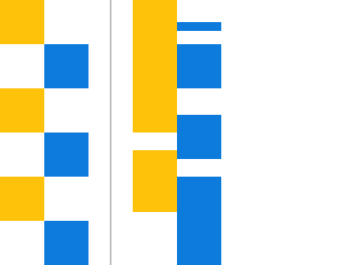

# Docs Asyncio

This is alternative documentation for Python's asyncio.

# Lexicon

| Name      | Description                           |
|-----------|---------------------------------------|
| Coroutine | Generator-like object                 |
| Future    | A basic awaitable object.             |
| Task      | Coroutine running on the loop itself. |
| Awaitable | Anything that that can be `await`-ed. |

# Parallel or Concurrency

Concurrency is "at the same time", but there are some rules. 
In a way, they are board games or card games.  
This means people take their turn, and tell when it's someone else's turn. 
In other words: it is directed, there are rules.

Parallel is threading, they're a bit like First-Person Shooters. 
It's everyone's turn, all the time, anything can happen!.

The following shows two concurrency and parallelism in a block diagram.

On the left side is concurrency, like async. 
The two colors (or columns) never execute at the same time. 
This means the task changes, but they do not get in the way of one another.

On the right side is parallelism, like threading. 
These can execute at the same time. 
Access to variables can be contested, and race conditions may occur.
